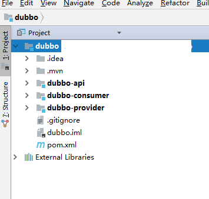
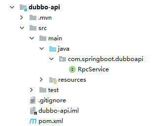
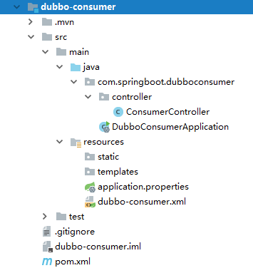
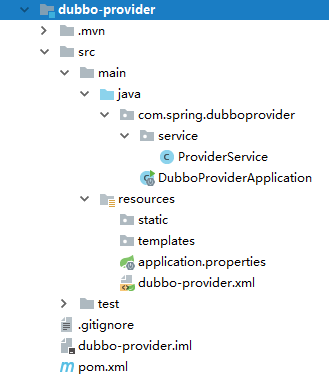

title: SpringBoot整合Dubbo总结  
tags: [SpringBoot,Dubbo]  
date: 2017-12-06  

---

### SpringBoot整合Dubbo ###  

很长一段时间没有写过东西了，前段时间整合了一下SpringBoot和Dubbo,在网上查了很多资料，然而还是有点乱的感觉。所以今天抽时间总结一下，希望对大家有所帮助  

#### 开始 ####  

##### 1.项目准备 #####  
zookeeper和dubbo-admin项目，保证能访问dubbo-admin项目查看服务注册情况  

##### 2.项目结构和依赖 #####  

##### 项目结构 #####
项目分为dubbo-api,dubbo-provider,dubbo-consumer三部分  
dubbo-api:服务提供的接口  
dubbo-provider:接口的实现，实现了服务提供者  
dubbo-consumer:服务消费者  

##### 项目依赖 #####  
dubbo-provider和dubbo-consumer分别依赖dubbo-api  

项目结构截图：  

  

  

  

  

#### pom文件 ###  
dubbo-api中pom文件  
```
<?xml version="1.0" encoding="UTF-8"?>
<project xmlns="http://maven.apache.org/POM/4.0.0" xmlns:xsi="http://www.w3.org/2001/XMLSchema-instance"
	xsi:schemaLocation="http://maven.apache.org/POM/4.0.0 http://maven.apache.org/xsd/maven-4.0.0.xsd">
	<modelVersion>4.0.0</modelVersion>

	<groupId>com.springboot</groupId>
	<artifactId>dubbo-api</artifactId>
	<version>0.0.1-SNAPSHOT</version>
	<packaging>jar</packaging>
	<name>dubbo-api</name>
</project>  
```

dubbo-provider中pom文件  
```
<?xml version="1.0" encoding="UTF-8"?>
<project xmlns="http://maven.apache.org/POM/4.0.0" xmlns:xsi="http://www.w3.org/2001/XMLSchema-instance"
	xsi:schemaLocation="http://maven.apache.org/POM/4.0.0 http://maven.apache.org/xsd/maven-4.0.0.xsd">
	<modelVersion>4.0.0</modelVersion>

	<groupId>com.spring</groupId>
	<artifactId>dubbo-provider</artifactId>
	<version>0.0.1-SNAPSHOT</version>
	<packaging>jar</packaging>

	<name>dubbo-provider</name>
	<description>Demo project for Spring Boot</description>

	<parent>
		<groupId>org.springframework.boot</groupId>
		<artifactId>spring-boot-starter-parent</artifactId>
		<version>1.5.9.RELEASE</version>
		<relativePath/> <!-- lookup parent from repository -->
	</parent>

    <properties>
        <project.build.sourceEncoding>UTF-8</project.build.sourceEncoding>
        <project.reporting.outputEncoding>UTF-8</project.reporting.outputEncoding>
        <java.version>1.8</java.version>
        <com.alibaba.dubbo.version>2.5.7</com.alibaba.dubbo.version>
        <org.apache.zookeeper.version>3.4.6</org.apache.zookeeper.version>
        <com.github.sgroschupf.zkclient.version>0.1</com.github.sgroschupf.zkclient.version>
    </properties>

    <dependencies>
        <dependency>
            <groupId>com.springboot</groupId>
            <artifactId>dubbo-api</artifactId>
            <version>0.0.1-SNAPSHOT</version>
        </dependency>

        <dependency>
            <groupId>org.springframework.boot</groupId>
            <artifactId>spring-boot-starter-web</artifactId>
        </dependency>

        <dependency>
            <groupId>org.springframework.boot</groupId>
            <artifactId>spring-boot-starter-test</artifactId>
            <scope>test</scope>
        </dependency>

        <dependency>
            <groupId>com.alibaba</groupId>
            <artifactId>dubbo</artifactId>
            <exclusions>
                <exclusion>
                    <groupId>org.springframework</groupId>
                    <artifactId>spring</artifactId>
                </exclusion>
            </exclusions>
            <version>${com.alibaba.dubbo.version}</version>
        </dependency>
        <dependency>
            <groupId>org.apache.zookeeper</groupId>
            <artifactId>zookeeper</artifactId>
            <version>${org.apache.zookeeper.version}</version>
        </dependency>
        <dependency>
            <groupId>com.github.sgroschupf</groupId>
            <artifactId>zkclient</artifactId>
            <version>${com.github.sgroschupf.zkclient.version}</version>
        </dependency>
    </dependencies>

    <build>
        <plugins>
            <plugin>
                <groupId>org.springframework.boot</groupId>
                <artifactId>spring-boot-maven-plugin</artifactId>
            </plugin>
        </plugins>
    </build>


</project>

```  
dubbo-consumer中pom文件  

```
<?xml version="1.0" encoding="UTF-8"?>
<project xmlns="http://maven.apache.org/POM/4.0.0" xmlns:xsi="http://www.w3.org/2001/XMLSchema-instance"
	xsi:schemaLocation="http://maven.apache.org/POM/4.0.0 http://maven.apache.org/xsd/maven-4.0.0.xsd">
	<modelVersion>4.0.0</modelVersion>

	<groupId>com.springboot</groupId>
	<artifactId>dubbo-consumer</artifactId>
	<version>0.0.1-SNAPSHOT</version>
	<packaging>jar</packaging>

	<name>dubbo-consumer</name>
	<description>Demo project for Spring Boot</description>

	<parent>
		<groupId>org.springframework.boot</groupId>
		<artifactId>spring-boot-starter-parent</artifactId>
		<version>1.5.9.RELEASE</version>
		<relativePath/> <!-- lookup parent from repository -->
	</parent>

	<properties>
		<project.build.sourceEncoding>UTF-8</project.build.sourceEncoding>
		<project.reporting.outputEncoding>UTF-8</project.reporting.outputEncoding>
		<java.version>1.8</java.version>
		<com.alibaba.dubbo.version>2.5.7</com.alibaba.dubbo.version>
		<org.apache.zookeeper.version>3.4.6</org.apache.zookeeper.version>
		<com.github.sgroschupf.zkclient.version>0.1</com.github.sgroschupf.zkclient.version>
	</properties>

	<dependencies>
		<dependency>
			<groupId>com.springboot</groupId>
			<artifactId>dubbo-api</artifactId>
			<version>0.0.1-SNAPSHOT</version>
		</dependency>

		<dependency>
			<groupId>org.springframework.boot</groupId>
			<artifactId>spring-boot-starter-web</artifactId>
		</dependency>

		<dependency>
			<groupId>org.springframework.boot</groupId>
			<artifactId>spring-boot-starter-test</artifactId>
			<scope>test</scope>
		</dependency>

		<dependency>
			<groupId>com.alibaba</groupId>
			<artifactId>dubbo</artifactId>
			<exclusions>
				<exclusion>
					<groupId>org.springframework</groupId>
					<artifactId>spring</artifactId>
				</exclusion>
			</exclusions>
			<version>${com.alibaba.dubbo.version}</version>
		</dependency>
		<dependency>
			<groupId>org.apache.zookeeper</groupId>
			<artifactId>zookeeper</artifactId>
			<version>${org.apache.zookeeper.version}</version>
		</dependency>
		<dependency>
			<groupId>com.github.sgroschupf</groupId>
			<artifactId>zkclient</artifactId>
			<version>${com.github.sgroschupf.zkclient.version}</version>
		</dependency>
	</dependencies>

	<build>
		<plugins>
			<plugin>
				<groupId>org.springframework.boot</groupId>
				<artifactId>spring-boot-maven-plugin</artifactId>
			</plugin>
		</plugins>
	</build>

</project>

```
#### 代码实现 ####  

api:
```
package com.springboot.dubboapi;

public interface RpcService {
    String sayHello(String name);
}  
```
consumer：
```
package com.springboot.dubboconsumer.controller;

import com.alibaba.dubbo.config.annotation.Reference;
import com.springboot.dubboapi.RpcService;
import org.springframework.beans.factory.annotation.Autowired;
import org.springframework.stereotype.Controller;
import org.springframework.web.bind.annotation.*;

@RestController
@RequestMapping("/user")
public class ConsumerController {

    @Reference
    private RpcService rpcService;

    @ResponseBody
    @PostMapping("/say/{name}")
    public String sayHello(@PathVariable("name") String name){
        return rpcService.sayHello(name);
    }
}
```
provider:
```
package com.spring.dubboprovider.service;

import com.springboot.dubboapi.RpcService;

public class ProviderService implements RpcService {
    @Override
    public String sayHello(String name) {
        return "Hello " + name;
    }
}

```

dubbo配置文件：  
提供者：
```
<?xml version="1.0" encoding="UTF-8"?>
<beans xmlns="http://www.springframework.org/schema/beans"
       xmlns:xsi="http://www.w3.org/2001/XMLSchema-instance" xmlns:dubbo="http://code.alibabatech.com/schema/dubbo"
       xsi:schemaLocation="http://www.springframework.org/schema/beans
    http://www.springframework.org/schema/beans/spring-beans.xsd
    http://code.alibabatech.com/schema/dubbo
    http://code.alibabatech.com/schema/dubbo/dubbo.xsd">

    <!-- 提供方应用信息，用于计算依赖关系 -->
    <dubbo:application name="dubbo-provider" />

    <!-- 注册中心暴露服务地址 -->
    <!-- <dubbo:registry address="multicast://224.5.6.7:1234" /> -->

    <!-- <dubbo:registry protocol="zookeeper" address="10.170.219.98:2181,10.173.55.173:2181" /> -->
    <dubbo:registry protocol="zookeeper" address="localhost:2181" />

    <dubbo:protocol name="dubbo" port="20880" />

    <bean id="providerServiceImpl" class="com.spring.dubboprovider.service.ProviderService" />

    <!-- 暴露的服务 -->
    <dubbo:service interface="com.springboot.dubboapi.RpcService"
                   ref="providerServiceImpl" retries="0" timeout="6000" />
</beans>
```

消费者：
```
<?xml version="1.0" encoding="UTF-8"?>
<beans xmlns="http://www.springframework.org/schema/beans"
       xmlns:xsi="http://www.w3.org/2001/XMLSchema-instance" xmlns:dubbo="http://code.alibabatech.com/schema/dubbo"
       xsi:schemaLocation="http://www.springframework.org/schema/beans
    http://www.springframework.org/schema/beans/spring-beans.xsd
    http://code.alibabatech.com/schema/dubbo
    http://code.alibabatech.com/schema/dubbo/dubbo.xsd">

    <!-- 提供方应用信息，用于计算依赖关系 -->
    <dubbo:application name="dubbo-consumer" />

    <!-- 注册中心暴露服务地址 -->
    <dubbo:registry protocol="zookeeper" address="localhost:2181"/>
    <dubbo:protocol name="dubbo" port="20881" />
    <dubbo:consumer timeout="5000" />

    <dubbo:annotation package="com.springboot.dubboconsumer.controller"/>
</beans>
```

最后需要在服务提供者和消费者项目的启动类中加入@ImportResource注解用来加载dubbo配置  
```
package com.spring.dubboprovider;

import org.springframework.boot.SpringApplication;
import org.springframework.boot.autoconfigure.SpringBootApplication;
import org.springframework.context.annotation.ImportResource;

@SpringBootApplication
@ImportResource("classpath:dubbo-provider.xml")
public class DubboProviderApplication {

	public static void main(String[] args) {
		SpringApplication.run(DubboProviderApplication.class, args);
	}
}

```  
#### 参考文章 ###
http://blog.csdn.net/cl_andywin/article/details/54318903  
http://lib.csdn.net/article/java/65555  
